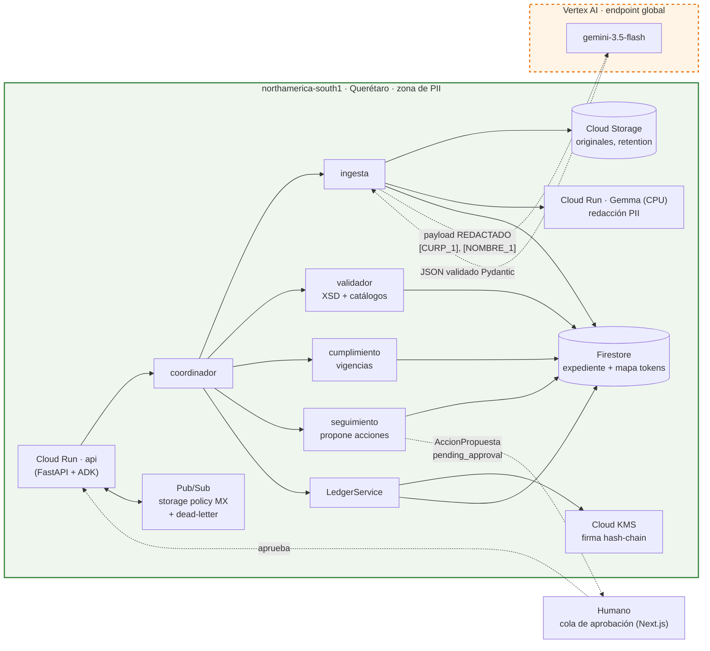

# Arquitectura v0 — herramienta de diseño (22 ago)

No es entregable. Existe para comprobar que se puede dibujar dónde vive el
estado, cómo se conecta Gemini y qué cruza la frontera. Si no se dibuja claro,
el diseño necesita otra pasada.

**Lo que cruza la línea punteada:** texto redactado hacia Gemini; JSON
estructurado de regreso. Nada más.

**Tres relojes** (SPEC §1): minutos (Carta Porte por viaje), semanas–meses
(vigencias), años (ledger inmutable). Los tres viven en Firestore + Storage en
México; el único reloj que toca Gemini es el de minutos, ya redactado.

Pendiente para v1 (D4): diagrama en PNG, `docs/architecture.png`.
